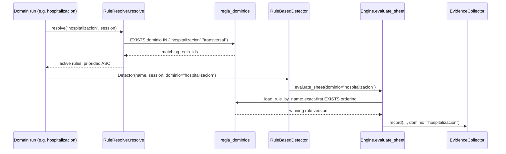

# Design: Reglas multi-dominio

## Decisions

### D1. Join table over JSONB list (rationale: test/prod parity)

`regla_dominios(regla_id, dominio)` with `EXISTS` subqueries works identically
on PostgreSQL (prod) and SQLite (tests). A `JSONB` list would need `?` (PG-only)
vs `json_each` (SQLite-only) membership operators, splitting the query layer
per backend. The join table is also indexable on `(dominio, regla_id)` and
keeps `uq_regla_nombre_version(nombre, version)` untouched.

### D2. Legacy `reglas.dominio` becomes a write-through mirror (rationale: safe rollback)

The column stays `NOT NULL`, keeps its values, and on every write is set to
the first sorted scope value. Old readers (evidence history views, rollback
code, raw SQL reports) keep working. Reads for engine resolution use the
bridge table exclusively, except the scope-less fallback (spec scenario).

### D3. One shared scope predicate (rationale: today's 4 OR-sites drifted)

All engine resolution funnels through a single helper:

```python
def rule_matches_domain(regla_id_column, domain: str):
    """SQLAlchemy EXISTS: scope contains domain or the transversal wildcard."""
    from sqlalchemy import exists, or_
    from app.models import ReglaDominio
    return exists(
        select(1)
        .where(ReglaDominio.regla_id == regla_id_column)
        .where(ReglaDominio.dominio.in_([domain, ENGINE_DOMAIN_TRANSVERSAL]))
    )
```

Placed next to `RuleResolver` (imported by `domain_detection` and `engine`).
Stray `'transversal'` literals are replaced with `ENGINE_DOMAIN_TRANSVERSAL`.

### D4. Vocabulary centralized in `app/constants/base.py` (rationale: AGENTS.md no-hardcode)

```python
REGLA_DOMINIOS_VALIDOS = frozenset({
    "urgencias", "hospitalizacion", "odontologia", "equipos_basicos",
    "transversal", "farmacia", "intramural", "ambulatoria",
})
```

Backend validates on write; frontend `DOMINIOS` mirrors the same ordered list
(existing `DOMINIOS` const already holds exactly these 8 — it becomes a copy
of the canonical order, documented as such).

### D5. Evidence untouched (rationale: INSERT-only history)

`Evidencia.dominio` keeps recording the *run* domain (single string). No
migration, no backfill. Pre/post-migration reports stay comparable because the
format never changes.

## Data model

```text
regla_dominios
  regla_id  INTEGER NOT NULL REFERENCES reglas(id) ON DELETE CASCADE
  dominio   VARCHAR(50) NOT NULL
  PRIMARY KEY (regla_id, dominio)
  INDEX ix_regla_dominios_dominio (dominio, regla_id)
```

`Regla` gains `dominios` relationship (`cascade="all, delete-orphan"`,
`lazy="selectin"` to avoid N+1 in list paths) and `to_dict()` emits
`"dominios": sorted([...])` alongside legacy `"dominio"`.

Migration `023_regla_dominios.sql` (+ `023_regla_dominios_rollback.sql`):

```sql
CREATE TABLE IF NOT EXISTS regla_dominios (
    regla_id INTEGER NOT NULL REFERENCES reglas(id) ON DELETE CASCADE,
    dominio VARCHAR(50) NOT NULL,
    PRIMARY KEY (regla_id, dominio)
);
CREATE INDEX IF NOT EXISTS ix_regla_dominios_dominio
    ON regla_dominios (dominio, regla_id);
INSERT INTO regla_dominios (regla_id, dominio)
SELECT id, dominio FROM reglas
WHERE NOT EXISTS (
    SELECT 1 FROM regla_dominios rd WHERE rd.regla_id = reglas.id
);
```

Idempotent (`IF NOT EXISTS` + guarded backfill), PG/SQLite portable
(no PG-only syntax — verified against the 022 SQL-text test precedent).

## Resolution flow



Dedup-by-name in `detect_domain_rules` is unchanged: one row now carries
N domains, so "one evaluation per (domain run, rule name)" still holds with
no extra logic.

## API shapes

```text
POST /api/reglas   { ..., "dominios": ["urgencias","hospitalizacion"] }
PUT  /api/reglas/<id>  { ..., "dominios": [...] }   # partial: absent = unchanged
GET  /api/reglas?dominio=X   # X ∈ scope (transversals included)
Regla.to_dict  { ..., "dominio": "<legacy mirror>", "dominios": [...] }
```

Validation errors return the standard envelope
`{"status": "error", "data": {}, "errors": [...]}` with HTTP 400.

## UI changes (admin-reglas)

- `api-reglas.ts`: `Regla.dominios: string[]` (required after migration;
  defensively default `[]` when absent for old payloads), keep `dominio`.
- Create/edit forms: checkbox group from shared `DOMINIOS` order; save blocked
  client-side when empty (server re-validates).
- Table + badges: stacked `DominioBadge`s; filters use ∈ semantics.
- The `SearchableSelect` pattern (input+datalist) is reused only where a
  single-value select remains (evidencias tab); scope editing is checkboxes,
  not a select, so the stored-unknown-value rule is satisfied by rendering
  unknown stored values as checked custom badges that survive save.

## Test plan (strict TDD, pytest + vitest)

Backend (`tests/reglas/test_regla_dominios.py`, new):
- backfill SQL-text test (precedent: 022 test — file exists, ordered after
  022, INSERT..SELECT present, no hardcoded ids);
- resolver loads multi/transversal/single, excludes others;
- exact-beats-transversal preserved;
- CRUD validation (empty/invalid → ValueError + rollback);
- duplicate/version copy scope; list filter ∈ semantics.

Frontend (`SearchableSelect`-adjacent, `page.tsx` scope editor test):
- multi-check save payload; badges render N dominios; filter ∈ behavior.

## Rollback

Apply `023_regla_dominios_rollback.sql` (`DROP TABLE regla_dominios`) + revert
code. Engine falls back to legacy column automatically since the bridge query
layer is the only new dependency and old code paths are preserved behind it
during the transition (feature code reads bridge-first, legacy-fallback).
